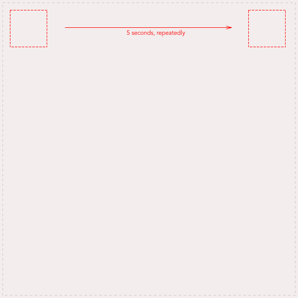

# drill-css-Animations
A challenge to implement a pixel-perfect animation in pure css.

## Instructions

   <h1><a href="https://becodeorg.github.io/End-of-Fields-Consolidation-Challenges/">End-of-Fields-Consolidation-Challenges</a></h1>

   <h1 id="drill-learn-css-animations">Drill: Learn CSS Animations</h1>

   
<strong>Duration</strong>: 6 hours 
      <strong>Team</strong>: false 
      <strong>Repo</strong>: <code class="highlighter-rouge">css-animation-drill</code>

   <h2 id="before-you-start">Before you start</h2>
   
First, <a href="https://becodeorg.github.io/End-of-Fields-Consolidation-Challenges/criteria.html">read the criteria</a> so that you know what is expected of you. 
      Then, <a href="https://marksheet.io/css-animations.html">learn</a> <a href="https://www.codeschool.com/courses/adventures-in-web-animations">about</a> <a href="https://cssanimation.rocks/">CSS</a> animations.

   <h2 id="the-exercise">The exercise</h2>
   
In this exercise, you will build a complex animation, step by step. 
      As often with CSS, this is an exercise in precision and accuracy (and a zest of dementia, because… CSS). To give you a reliable visual assistant, you will thus use a technique that could be called “the image background guide Technique”.

   
<strong>Tip: the image background guide Technique</strong>: for each step of the exercise, use these <a href="https://becodeorg.github.io/End-of-Fields-Consolidation-Challenges/images.zip">images (zip)</a> as your body’s background image
      (with a slight opacity perhaps?) to help you style precisely.

   
Of course, when done, remove the background image for a cleaner look.

   

      

         <pre class="highlight"><code>&lt;div id="stage" style="background: transparent url(./images/css_animation_exercise_stage.png) 0 0 no-repeat;"&gt;
</code></pre>
      

   

   <ul>
      <li>Create a standard index.html page</li>
      <li>Create the stage: add a div with the id “stage”, style it so that it appears exactly like this image, and in the horizontal middle of your index page.</li>
   </ul>

   

   <ul>
      <li>Add a div with an id “hero”.</li>
      <li>Style the <code class="highlighter-rouge">#hero</code> so it looks exactly like this:</li>
   </ul>

   

   
Now, construct the animation step by step.

   <h2 id="step-1">Step 1</h2>

   
Move the hero to the right, one time.

   

   <h2 id="step-2">Step 2</h2>

   
Move the hero to the right, in 5 seconds, indefinitely (loop animation).

   

   <h2 id="step-3">Step 3</h2>

   
Move the hero to the right, then to the left, in 2 seconds, indefinitely (loop animation).

   

   <h2 id="step-4">Step 4</h2>

   
Oh well, that was a ton of fun. But let’s go back to step 2.

   

   <h2 id="step-5-7">Step 5-7
   </h2>

   
You got it ? Ok, now follow these instructions. Think “pixel-perfect”.

   

   <h2 id="done-">Done ?</h2>

   
Are you sure ? <a href="https://becodeorg.github.io/End-of-Fields-Consolidation-Challenges/criteria.html">Review the criteria</a> before sending your work to the coaches.

   <h2 id="really-done-">Really done ?</h2>

   
Bravo !

   

## Result

https://taggar.github.io/drill-css-animations/
